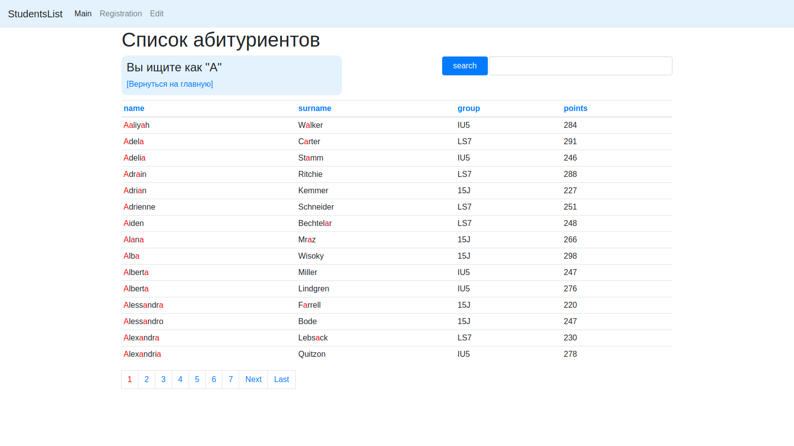
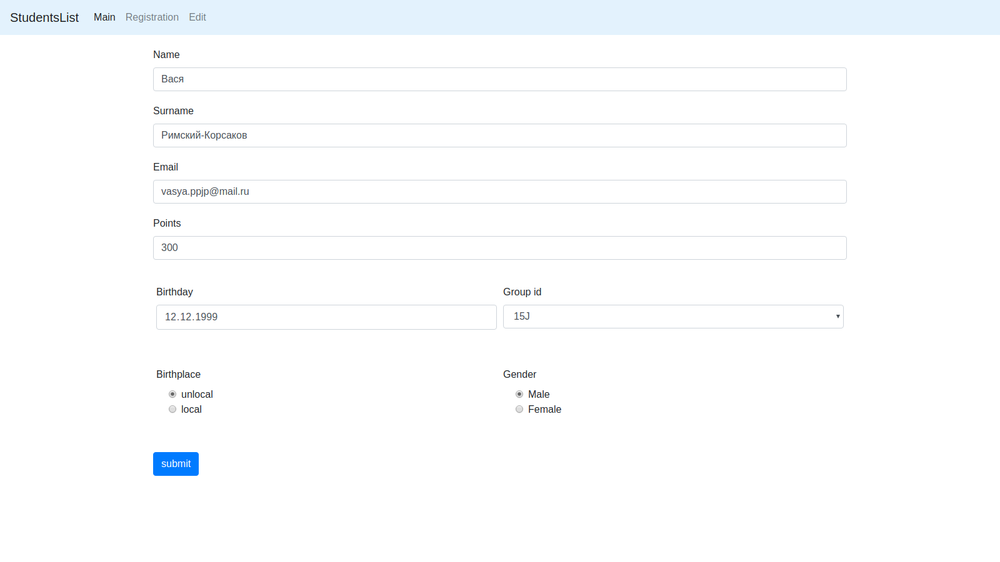
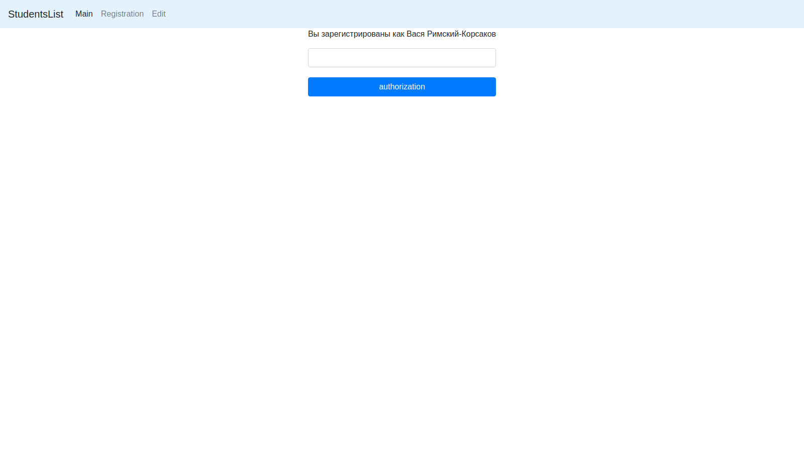

# Сайт для регистрации студентов StudentList

## Используемые технологии

+ ООП
+ Depency Injection
+ MVC
+ паттерн TableDataGateway
+ Twig
+ Twitter Bootstrap
+ Защита от XSRF,XSS уязвимостей и SQL инъекций
+ PDO
+ Composer Autoload
+ AJAX
+ Jquey
+ JSON
+ Git

## Краткое описание
### Сайт разделен на 3 страницы  
__Main__ - список студентов с поиском, сортировкой по всем полям и страничной навигацией.  
__Registration__ - регистрация производится через email, пароль генерируется автоматически, используется AJAX.  
__Edit__ - страница с редактированием данных пользователя.
## Установка
+ создать таблицу на основе дампа в `database.sql`
+ создать `config.json` на примере `config.example.json`, указать путь к проекту и настройки базы данных
+ Установить  Апач и скопировать настройки в файле `httpd.conf`
+ Установить [Сomposer](https://getcomposer.org/)
## Требования
+ PHP >= 7.0 
+ MySQL 5.7.21
+ Apache/2.4.18 

## Скриншоты программы

